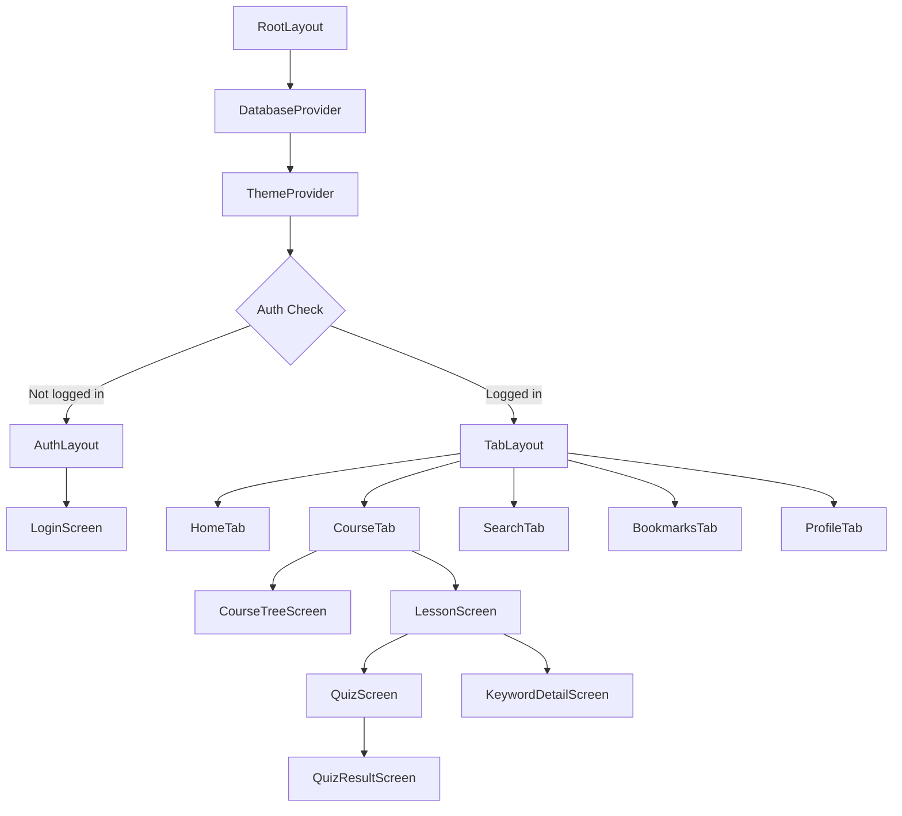
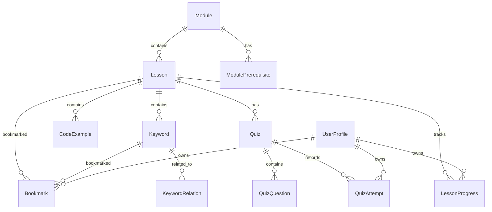

# Thiết Kế — Java Spring Course Package

## Overview

Ứng dụng mobile học tập Java Spring, chạy hoàn toàn offline trên Samsung S24 Ultra (và các thiết bị Android khác). Nội dung khóa học được parse từ các file markdown trong thư mục `doc/`, chuyển đổi thành structured data (JSON), và nạp vào WatermelonDB khi cài đặt lần đầu.

### Mục tiêu chính

- **Local-first**: Toàn bộ nội dung, tiến độ, bookmarks, quiz results lưu trên thiết bị
- **Content pipeline**: Markdown → JSON seed data → WatermelonDB (tại build time, không parse runtime)
- **Offline learning**: Không yêu cầu kết nối mạng cho bất kỳ tính năng nào
- **Resume learning**: Tự động quay lại bài học gần nhất khi mở app
- **Samsung S24 Ultra optimized**: Tận dụng màn hình 6.8" QHD+ với safe area handling

### Luồng dữ liệu tổng quan

```
┌─────────────────────────────────────────────────────────────┐
│                     BUILD TIME                               │
│                                                              │
│  doc/*.md  ──▶  parse-content.ts  ──▶  seed-data/*.json     │
│  (markdown)     (Node.js script)       (bundled with app)    │
└─────────────────────────────────────────────────────────────┘
                          │
                          ▼
┌─────────────────────────────────────────────────────────────┐
│                     RUNTIME (First Launch)                    │
│                                                              │
│  seed-data/*.json  ──▶  SeedService  ──▶  WatermelonDB      │
│                         (batch write)      (SQLite)          │
└─────────────────────────────────────────────────────────────┘
                          │
                          ▼
┌─────────────────────────────────────────────────────────────┐
│                     RUNTIME (Normal Use)                     │
│                                                              │
│  WatermelonDB  ◀──▶  Zustand Stores  ◀──▶  React Components │
│  (queries)           (state mgmt)          (UI rendering)    │
│                                                              │
│  AsyncStorage  ◀──▶  Settings (theme, font size, last lesson)│
└─────────────────────────────────────────────────────────────┘
```

---

## Architecture

### Kiến trúc tổng thể

Ứng dụng theo kiến trúc **layered architecture** với 4 tầng rõ ràng:

```
┌─────────────────────────────────────────────────┐
│              Presentation Layer                   │
│  Screens (Expo Router) + Components (RN Paper)   │
├─────────────────────────────────────────────────┤
│              State Management Layer               │
│  Zustand Stores (with immer middleware)           │
├─────────────────────────────────────────────────┤
│              Service Layer                        │
│  SearchService, QuizService, ProgressService,    │
│  BookmarkService, SeedService                    │
├─────────────────────────────────────────────────┤
│              Data Layer                           │
│  WatermelonDB (SQLite) + AsyncStorage            │
└─────────────────────────────────────────────────┘
```

### Expo Router — Navigation Structure

```
app/
├── _layout.tsx                    # Root layout (DatabaseProvider, ThemeProvider)
├── (auth)/
│   ├── _layout.tsx                # Auth layout (no bottom tabs)
│   └── login.tsx                  # Local login screen (PIN/profile select)
├── (tabs)/
│   ├── _layout.tsx                # Tab navigator layout
│   ├── index.tsx                  # Home — resume learning, progress overview
│   ├── course/
│   │   ├── _layout.tsx            # Stack navigator for course
│   │   ├── index.tsx              # Course tree — module/lesson directory
│   │   └── [lessonId].tsx         # Lesson content viewer
│   ├── search.tsx                 # Search screen
│   ├── bookmarks.tsx              # Bookmarks & notes
│   └── profile.tsx                # Profile, settings, progress stats
├── quiz/
│   ├── [quizId].tsx               # Quiz taking screen
│   └── result/[attemptId].tsx     # Quiz result screen
└── keyword/
    └── [keywordId].tsx            # Keyword detail screen
```

### Mermaid — Component Hierarchy



---

## Components and Interfaces

### Zustand Stores

#### AuthStore
Quản lý local authentication — không server, chỉ profile selection với optional PIN.

```typescript
interface UserProfile {
  id: string;
  name: string;
  avatarIndex: number;
  pinHash: string | null; // bcrypt hash, null = no PIN
  createdAt: number;
}

interface AuthState {
  currentUser: UserProfile | null;
  profiles: UserProfile[];
  isAuthenticated: boolean;
}

interface AuthActions {
  login: (profileId: string, pin?: string) => Promise<boolean>;
  logout: () => void;
  createProfile: (name: string, pin?: string) => Promise<UserProfile>;
  deleteProfile: (profileId: string) => Promise<void>;
}
```

#### ProgressStore
Theo dõi tiến độ học tập, tính toán completion percentages.

```typescript
interface ProgressState {
  lessonProgress: Map<string, LessonProgress>;
  moduleProgress: Map<string, ModuleProgress>;
  overallProgress: number; // 0-100
  lastLessonId: string | null;
  lastScrollPosition: number;
}

interface ProgressActions {
  markLessonComplete: (lessonId: string, timeSpent: number) => Promise<void>;
  updateScrollPosition: (lessonId: string, position: number) => Promise<void>;
  getNextLesson: () => Promise<string | null>;
  getModuleCompletion: (moduleId: string) => number;
}
```

#### CourseStore
Quản lý course tree structure và navigation state.

```typescript
interface CourseState {
  modules: Module[];
  expandedModules: Set<string>;
  selectedLessonId: string | null;
  isLoading: boolean;
}

interface CourseActions {
  loadCourseTree: () => Promise<void>;
  toggleModule: (moduleId: string) => void;
  selectLesson: (lessonId: string) => void;
  isModuleUnlocked: (moduleId: string) => boolean;
}
```

#### SearchStore
Tìm kiếm nội dung trong lessons, keywords, code examples.

```typescript
interface SearchState {
  query: string;
  results: SearchResults;
  isSearching: boolean;
  recentSearches: string[];
}

interface SearchResults {
  lessons: LessonSearchResult[];
  keywords: KeywordSearchResult[];
  codeExamples: CodeExampleSearchResult[];
}

interface SearchActions {
  search: (query: string) => Promise<void>;
  clearSearch: () => void;
  addRecentSearch: (query: string) => void;
}
```

#### QuizStore
Quản lý quiz state, câu trả lời, và kết quả.

```typescript
interface QuizState {
  currentQuiz: Quiz | null;
  currentQuestionIndex: number;
  answers: Map<string, string>; // questionId → selectedAnswer
  isSubmitted: boolean;
  score: number | null;
}

interface QuizActions {
  loadQuiz: (quizId: string) => Promise<void>;
  answerQuestion: (questionId: string, answer: string) => void;
  submitQuiz: () => Promise<QuizAttempt>;
  resetQuiz: () => void;
  nextQuestion: () => void;
  previousQuestion: () => void;
}
```

#### BookmarkStore
Quản lý bookmarks và ghi chú.

```typescript
interface BookmarkState {
  bookmarks: Bookmark[];
  filterModule: string | null;
  filterType: 'lesson' | 'keyword' | null;
}

interface BookmarkActions {
  toggleBookmark: (itemId: string, itemType: 'lesson' | 'keyword') => Promise<void>;
  updateNote: (bookmarkId: string, note: string) => Promise<void>;
  deleteBookmark: (bookmarkId: string) => Promise<void>;
  isBookmarked: (itemId: string) => boolean;
  setFilter: (module?: string, type?: 'lesson' | 'keyword') => void;
}
```

### Key UI Components

#### ContentRenderer
Component chính hiển thị nội dung bài học từ parsed markdown.

```typescript
interface ContentRendererProps {
  content: LessonContent;
  onKeywordPress: (keywordId: string) => void;
  onCodeCopy: (code: string) => void;
  onScrollPositionChange: (position: number) => void;
  initialScrollPosition?: number;
}
```

Responsibilities:
- Render markdown sections (headings, paragraphs, tables, lists)
- Render code blocks với syntax highlighting (sử dụng `react-native-syntax-highlighter` hoặc custom highlighter cho Java)
- Render keyword links có thể tap để xem chi tiết
- Hỗ trợ copy code to clipboard
- Track scroll position để resume learning
- Hiển thị multi-file code examples với tab interface

#### CourseTree
Component hiển thị cấu trúc khóa học dạng tree/directory.

```typescript
interface CourseTreeProps {
  modules: Module[];
  expandedModules: Set<string>;
  onToggleModule: (moduleId: string) => void;
  onSelectLesson: (lessonId: string) => void;
  moduleProgress: Map<string, number>; // moduleId → completion %
  unlockedModules: Set<string>;
}
```

#### QuizCard
Component hiển thị một câu hỏi quiz.

```typescript
interface QuizCardProps {
  question: QuizQuestion;
  selectedAnswer: string | null;
  onSelectAnswer: (answer: string) => void;
  isSubmitted: boolean;
  correctAnswer?: string;
  explanation?: string;
}
```

#### CodeBlock
Component hiển thị code với syntax highlighting.

```typescript
interface CodeBlockProps {
  code: string;
  language: string;
  fileName?: string;
  showLineNumbers: boolean;
  onCopy: () => void;
}
```

### Service Layer

#### SeedService
Nạp seed data vào WatermelonDB khi cài đặt lần đầu.

```typescript
interface SeedService {
  isSeeded: () => Promise<boolean>;
  getSeedVersion: () => Promise<number>;
  seed: (onProgress: (percent: number) => void) => Promise<void>;
  resumeSeed: (onProgress: (percent: number) => void) => Promise<void>;
}
```

Strategy:
- Kiểm tra `AsyncStorage.getItem('seed_version')` khi app khởi động
- Nếu chưa seed hoặc version cũ → bắt đầu seed process
- Seed theo batch (mỗi batch = 1 module) để có thể resume nếu bị gián đoạn
- Lưu `last_seeded_module` vào AsyncStorage để track progress
- Sau khi hoàn thành → lưu `seed_version`

#### SearchService
Tìm kiếm nội dung trong WatermelonDB.

```typescript
interface SearchService {
  searchAll: (query: string) => Promise<SearchResults>;
  searchLessons: (query: string) => Promise<LessonSearchResult[]>;
  searchKeywords: (query: string) => Promise<KeywordSearchResult[]>;
  searchCodeExamples: (query: string) => Promise<CodeExampleSearchResult[]>;
  getSuggestions: (query: string) => Promise<string[]>;
}
```

Strategy:
- Sử dụng WatermelonDB `Q.where` với `Q.like` cho text search
- Tìm kiếm trong: lesson title, keyword name, keyword definition, code example description
- Hỗ trợ cả tiếng Việt và tiếng Anh (search trên cả hai trường)
- Kết quả nhóm theo loại: Lessons, Keywords, Code Examples
- Target: trả về kết quả trong 500ms

#### QuizEvaluationService
Đánh giá câu trả lời quiz.

```typescript
interface QuizEvaluationService {
  evaluateAnswer: (question: QuizQuestion, userAnswer: string) => AnswerResult;
  calculateScore: (results: AnswerResult[]) => QuizScore;
  getExplanation: (question: QuizQuestion) => string;
  getRelatedLessonSection: (question: QuizQuestion) => string;
}

interface AnswerResult {
  questionId: string;
  isCorrect: boolean;
  correctAnswer: string;
  userAnswer: string;
  explanation: string;
  relatedLessonId: string;
}
```

Strategy:
- Câu hỏi trắc nghiệm: so sánh trực tiếp `userAnswer === correctAnswer`
- Mỗi câu hỏi có sẵn `correctAnswer` và `explanation` trong seed data
- Liên kết đến phần nội dung liên quan trong lesson khi trả lời sai

---

## Data Models

### WatermelonDB Schema



#### Tables

```typescript
// schema.ts — WatermelonDB schema definition
import { appSchema, tableSchema } from '@nozbe/watermelondb';

export const schema = appSchema({
  version: 1,
  tables: [
    // ─── User Profiles ───
    tableSchema({
      name: 'user_profiles',
      columns: [
        { name: 'name', type: 'string' },
        { name: 'avatar_index', type: 'number' },
        { name: 'pin_hash', type: 'string', isOptional: true },
        { name: 'created_at', type: 'number' },
      ],
    }),

    // ─── Course Structure ───
    tableSchema({
      name: 'modules',
      columns: [
        { name: 'title', type: 'string' },
        { name: 'title_vi', type: 'string' },
        { name: 'description', type: 'string' },
        { name: 'order_index', type: 'number', isIndexed: true },
        { name: 'difficulty_level', type: 'string' }, // beginner|intermediate|advanced|expert
        { name: 'icon_name', type: 'string' },
        { name: 'lesson_count', type: 'number' },
      ],
    }),

    tableSchema({
      name: 'module_prerequisites',
      columns: [
        { name: 'module_id', type: 'string', isIndexed: true },
        { name: 'prerequisite_module_id', type: 'string', isIndexed: true },
      ],
    }),

    tableSchema({
      name: 'lessons',
      columns: [
        { name: 'module_id', type: 'string', isIndexed: true },
        { name: 'title', type: 'string' },
        { name: 'title_vi', type: 'string' },
        { name: 'description', type: 'string' },
        { name: 'order_index', type: 'number', isIndexed: true },
        { name: 'content_json', type: 'string' }, // parsed markdown as JSON
        { name: 'source_file', type: 'string' },  // original md file path
        { name: 'estimated_minutes', type: 'number' },
      ],
    }),

    // ─── Keywords ───
    tableSchema({
      name: 'keywords',
      columns: [
        { name: 'lesson_id', type: 'string', isIndexed: true },
        { name: 'name', type: 'string', isIndexed: true },
        { name: 'definition', type: 'string' },       // max 100 chars
        { name: 'explanation', type: 'string' },       // detailed explanation
        { name: 'code_example', type: 'string', isOptional: true },
        { name: 'category', type: 'string', isIndexed: true }, // java-core|oop|advanced|spring-core|...
      ],
    }),

    tableSchema({
      name: 'keyword_relations',
      columns: [
        { name: 'keyword_id', type: 'string', isIndexed: true },
        { name: 'related_keyword_id', type: 'string', isIndexed: true },
      ],
    }),

    // ─── Code Examples ───
    tableSchema({
      name: 'code_examples',
      columns: [
        { name: 'lesson_id', type: 'string', isIndexed: true },
        { name: 'title', type: 'string' },
        { name: 'description', type: 'string' },
        { name: 'code', type: 'string' },
        { name: 'language', type: 'string' },  // java, xml, yaml, etc.
        { name: 'file_name', type: 'string', isOptional: true },
        { name: 'order_index', type: 'number' },
      ],
    }),

    // ─── Quizzes ───
    tableSchema({
      name: 'quizzes',
      columns: [
        { name: 'lesson_id', type: 'string', isIndexed: true },
        { name: 'title', type: 'string' },
        { name: 'question_count', type: 'number' },
      ],
    }),

    tableSchema({
      name: 'quiz_questions',
      columns: [
        { name: 'quiz_id', type: 'string', isIndexed: true },
        { name: 'question_text', type: 'string' },
        { name: 'question_type', type: 'string' }, // multiple_choice | short_answer
        { name: 'options_json', type: 'string' },   // JSON array of options
        { name: 'correct_answer', type: 'string' },
        { name: 'explanation', type: 'string' },
        { name: 'related_keyword_id', type: 'string', isOptional: true },
        { name: 'order_index', type: 'number' },
      ],
    }),

    // ─── User Progress ───
    tableSchema({
      name: 'lesson_progress',
      columns: [
        { name: 'user_id', type: 'string', isIndexed: true },
        { name: 'lesson_id', type: 'string', isIndexed: true },
        { name: 'is_completed', type: 'boolean' },
        { name: 'completed_at', type: 'number', isOptional: true },
        { name: 'time_spent_seconds', type: 'number' },
        { name: 'scroll_position', type: 'number' },
        { name: 'last_accessed_at', type: 'number' },
      ],
    }),

    tableSchema({
      name: 'quiz_attempts',
      columns: [
        { name: 'user_id', type: 'string', isIndexed: true },
        { name: 'quiz_id', type: 'string', isIndexed: true },
        { name: 'score', type: 'number' },
        { name: 'total_questions', type: 'number' },
        { name: 'answers_json', type: 'string' }, // JSON: { questionId: userAnswer }
        { name: 'completed_at', type: 'number' },
      ],
    }),

    // ─── Bookmarks ───
    tableSchema({
      name: 'bookmarks',
      columns: [
        { name: 'user_id', type: 'string', isIndexed: true },
        { name: 'item_id', type: 'string', isIndexed: true },
        { name: 'item_type', type: 'string' }, // lesson | keyword
        { name: 'note', type: 'string', isOptional: true },
        { name: 'created_at', type: 'number' },
      ],
    }),
  ],
});
```

### AsyncStorage Keys

Chỉ dùng cho settings nhỏ, không structured data:

| Key | Type | Purpose |
|-----|------|---------|
| `@theme` | `'light' \| 'dark' \| 'system'` | Theme preference |
| `@font_size` | `number` | Font size multiplier (0.8–1.4) |
| `@seed_version` | `number` | Current seed data version |
| `@seed_last_module` | `string` | Last successfully seeded module ID (for resume) |
| `@current_user_id` | `string` | Currently logged-in user profile ID |
| `@last_lesson_id` | `string` | Last opened lesson ID (quick resume) |

### Content JSON Structure

Mỗi lesson's `content_json` chứa parsed markdown dưới dạng structured JSON:

```typescript
interface LessonContent {
  sections: ContentSection[];
}

interface ContentSection {
  type: 'heading' | 'paragraph' | 'code_block' | 'table' | 'list' | 'keyword_ref' | 'diagram';
  level?: number;           // for headings: 1, 2, 3
  text?: string;            // for paragraph, heading
  code?: string;            // for code_block
  language?: string;        // for code_block: 'java', 'xml', etc.
  fileName?: string;        // for code_block: optional file name
  rows?: string[][];        // for table
  headers?: string[];       // for table
  items?: string[];         // for list
  ordered?: boolean;        // for list
  keywordId?: string;       // for keyword_ref
  children?: ContentSection[]; // for nested content
}
```

---


## Correctness Properties

*A property is a characteristic or behavior that should hold true across all valid executions of a system — essentially, a formal statement about what the system should do. Properties serve as the bridge between human-readable specifications and machine-verifiable correctness guarantees.*

### Property 1: Module prerequisite unlock logic

*For any* module and *for any* set of completed modules, `isModuleUnlocked(moduleId)` SHALL return `true` if and only if every prerequisite module for that module is in the completed set (or the module has no prerequisites).

**Validates: Requirements 1.3, 2.4**

### Property 2: All lessons contain at least one code block

*For any* lesson in the course database, the parsed `content_json` SHALL contain at least one section of type `code_block`.

**Validates: Requirements 2.2, 3.2, 4.2**

### Property 3: Keyword entry completeness

*For any* keyword entry in the database, it SHALL have a non-empty `name`, a `definition` of at most 100 characters, a non-empty `explanation`, and a valid `lesson_id` referencing an existing lesson.

**Validates: Requirements 11.1**

### Property 4: Keyword search returns matching results

*For any* keyword whose `name` is used as a search query, the search results SHALL include that keyword in the returned keyword results list.

**Validates: Requirements 11.2**

### Property 5: Progress completion percentage calculation

*For any* module (or the entire course) with N total lessons and M completed lessons (where 0 ≤ M ≤ N), the computed completion percentage SHALL equal `Math.round((M / N) * 100)`.

**Validates: Requirements 12.2, 12.3**

### Property 6: Next lesson is first uncompleted in order

*For any* set of completed lessons, `getNextLesson()` SHALL return the first lesson (by module order, then lesson order) that is not in the completed set, or `null` if all lessons are completed.

**Validates: Requirements 12.4**

### Property 7: Search returns grouped results across all content types

*For any* search query that matches content in lessons, keywords, and code examples, the returned `SearchResults` SHALL contain separate non-empty arrays for each matching content type (lessons, keywords, codeExamples).

**Validates: Requirements 13.1, 13.3**

### Property 8: Bookmark persistence round-trip

*For any* lesson or keyword, creating a bookmark and then querying bookmarks SHALL return a bookmark with the same `item_id`, `item_type`, and a valid `created_at` timestamp.

**Validates: Requirements 14.1**

### Property 9: Bookmarks sorted by creation time

*For any* set of bookmarks with distinct `created_at` timestamps, querying all bookmarks SHALL return them sorted by `created_at` in descending order (newest first).

**Validates: Requirements 14.2**

### Property 10: Bookmark deletion

*For any* existing bookmark, after calling `deleteBookmark(bookmarkId)`, querying for that bookmark by ID SHALL return no results.

**Validates: Requirements 14.3**

### Property 11: Every lesson has a quiz with sufficient questions

*For any* lesson in the database, there SHALL exist at least one quiz associated with that lesson, and that quiz SHALL contain at least 3 questions.

**Validates: Requirements 15.1**

### Property 12: All quiz attempts are preserved

*For any* quiz and *for any* number N of submissions (N ≥ 1), after submitting the quiz N times, the `quiz_attempts` table SHALL contain exactly N records for that quiz, each with correct `quiz_id`, `score`, `answers_json`, and `completed_at`.

**Validates: Requirements 15.2, 15.4**

### Property 13: Wrong answer evaluation returns explanation

*For any* quiz question and *for any* user answer that differs from the `correct_answer`, `evaluateAnswer()` SHALL return `isCorrect: false`, the `correctAnswer`, a non-empty `explanation`, and a valid `relatedLessonId`.

**Validates: Requirements 15.3**

### Property 14: Seed resume idempotency

*For any* interruption point during the seeding process (after completing module K of N), resuming the seed SHALL produce the same final database state as a complete uninterrupted seed — no duplicate records and no missing records.

**Validates: Requirements 18.4**

### Property 15: Progress mark-complete round-trip

*For any* lesson, marking it as complete with a given `timeSpent` value and then reading the `lesson_progress` record SHALL return `is_completed: true`, a valid `completed_at` timestamp, and the same `time_spent_seconds` value.

**Validates: Requirements 12.1**

---

## Error Handling

### Database Errors

| Scenario | Handling Strategy |
|----------|------------------|
| WatermelonDB write failure | Wrap all writes in try/catch. Show toast "Lưu thất bại, vui lòng thử lại". Retry once automatically. |
| WatermelonDB read failure | Return empty/default state. Log error. Show inline error message with retry button. |
| Seed data corruption | Detect via version check. Offer "Reset dữ liệu" option in settings that re-seeds from JSON. |
| Seed interruption | Track `@seed_last_module` in AsyncStorage. On next launch, detect incomplete seed and resume. |

### Content Parsing Errors

| Scenario | Handling Strategy |
|----------|------------------|
| Malformed JSON in `content_json` | Catch parse error, show "Nội dung bị lỗi" placeholder with lesson title. Log error. |
| Missing code block language | Default to `'java'` since this is a Java course. |
| Empty lesson content | Show "Nội dung đang được cập nhật" message. |

### User Input Errors

| Scenario | Handling Strategy |
|----------|------------------|
| Empty search query | Ignore, show recent searches instead. |
| Search query too short (< 2 chars) | Show hint "Nhập ít nhất 2 ký tự". |
| Invalid PIN on login | Show "PIN không đúng" with shake animation. Max 5 attempts then 30s cooldown. |
| Bookmark note too long (> 500 chars) | Truncate at 500 chars with character counter. |

### Quiz Errors

| Scenario | Handling Strategy |
|----------|------------------|
| Quiz with no questions (data error) | Skip quiz, show "Quiz chưa sẵn sàng" message. |
| Quiz submission fails to save | Retry save. If still fails, show results but warn "Kết quả chưa được lưu". |

### Navigation Errors

| Scenario | Handling Strategy |
|----------|------------------|
| Deep link to non-existent lesson | Redirect to course tree with toast "Bài học không tồn tại". |
| Accessing locked module | Show lock icon with prerequisite info: "Hoàn thành [module name] trước". |

---

## Testing Strategy

### Testing Framework & Tools

- **Unit tests**: Jest (bundled with Expo)
- **Property-based tests**: `fast-check` library for TypeScript
- **Component tests**: React Native Testing Library (`@testing-library/react-native`)
- **WatermelonDB tests**: In-memory SQLite adapter for test isolation

### Property-Based Testing Configuration

Each property test runs minimum **100 iterations** with `fast-check`.

Tag format: `Feature: java-spring-course-package, Property {number}: {property_text}`

```typescript
// Example property test structure
import fc from 'fast-check';

describe('Feature: java-spring-course-package', () => {
  it('Property 5: Progress completion percentage calculation', () => {
    fc.assert(
      fc.property(
        fc.integer({ min: 1, max: 100 }),  // totalLessons
        fc.integer({ min: 0, max: 100 }),  // completedLessons (clamped below)
        (total, completed) => {
          const clamped = Math.min(completed, total);
          const expected = Math.round((clamped / total) * 100);
          const actual = calculateCompletionPercentage(clamped, total);
          return actual === expected;
        }
      ),
      { numRuns: 100 }
    );
  });
});
```

### Test Categories

#### Property Tests (fast-check, 100+ iterations each)

| Property | What It Tests | Generator Strategy |
|----------|--------------|-------------------|
| P1: Module unlock | Prerequisite logic | Random module IDs + random completion sets |
| P2: Lessons have code | Content data invariant | Iterate all lessons from test DB |
| P3: Keyword completeness | Data integrity | Iterate all keywords from test DB |
| P4: Keyword search | Search relevance | Random keyword names as queries |
| P5: Completion % | Pure calculation | Random (total, completed) pairs |
| P6: Next lesson | Ordering logic | Random completion sets |
| P7: Search grouping | Search structure | Random queries matching known content |
| P8: Bookmark round-trip | Persistence | Random item IDs + types |
| P9: Bookmark ordering | Sort correctness | Random bookmark sets with timestamps |
| P10: Bookmark deletion | Deletion | Random bookmark IDs |
| P11: Quiz per lesson | Data invariant | Iterate all lessons from test DB |
| P12: Quiz attempts | Persistence | Random quiz IDs + N submissions |
| P13: Wrong answer eval | Evaluation logic | Random questions + wrong answers |
| P14: Seed resume | Idempotency | Random interruption points |
| P15: Progress round-trip | Persistence | Random lesson IDs + time values |

#### Unit Tests (Jest, example-based)

- Seed data structure validation (all modules, lessons exist with correct order)
- Specific module content verification (Req 2.1, 3.1, 4.1, etc.)
- Search with Vietnamese and English terms (Req 13.2)
- Empty search results with suggestions (Req 13.4)
- PIN hashing and verification
- AsyncStorage key management
- Content JSON parsing edge cases

#### Component Tests (React Native Testing Library)

- ContentRenderer renders headings, paragraphs, code blocks, tables
- CodeBlock shows syntax highlighting, line numbers, copy button
- CourseTree renders module/lesson hierarchy with progress indicators
- QuizCard renders question, options, and explanation on wrong answer
- Multi-file code example tab switching

#### Integration Tests

- Full seed process: JSON → WatermelonDB → query verification
- App startup flow: seed check → login → resume lesson
- Complete learning flow: open lesson → scroll → mark complete → check progress
- Quiz flow: start quiz → answer questions → submit → view results → retake

### Test File Structure

```
__tests__/
├── properties/
│   ├── module-unlock.property.test.ts
│   ├── completion-percentage.property.test.ts
│   ├── next-lesson.property.test.ts
│   ├── search.property.test.ts
│   ├── bookmark.property.test.ts
│   ├── quiz.property.test.ts
│   ├── seed-resume.property.test.ts
│   ├── progress-roundtrip.property.test.ts
│   └── data-invariants.property.test.ts
├── unit/
│   ├── services/
│   │   ├── search-service.test.ts
│   │   ├── quiz-evaluation-service.test.ts
│   │   ├── seed-service.test.ts
│   │   └── progress-service.test.ts
│   ├── stores/
│   │   ├── auth-store.test.ts
│   │   ├── course-store.test.ts
│   │   └── quiz-store.test.ts
│   └── utils/
│       ├── content-parser.test.ts
│       └── pin-utils.test.ts
├── components/
│   ├── content-renderer.test.tsx
│   ├── code-block.test.tsx
│   ├── course-tree.test.tsx
│   └── quiz-card.test.tsx
└── integration/
    ├── seed-flow.test.ts
    ├── learning-flow.test.ts
    └── quiz-flow.test.ts
```
